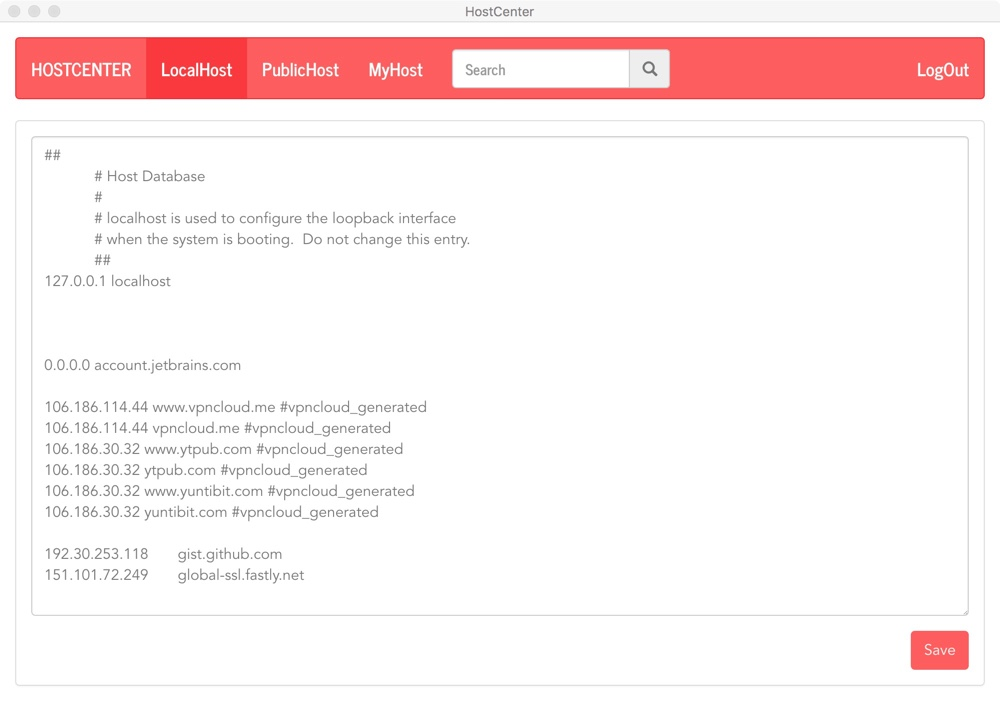
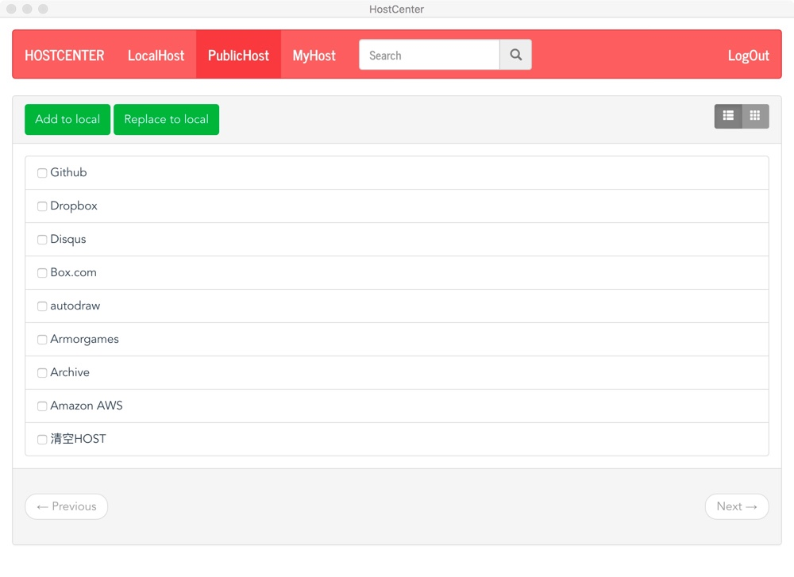
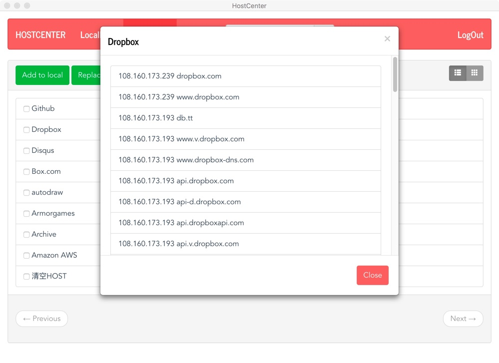
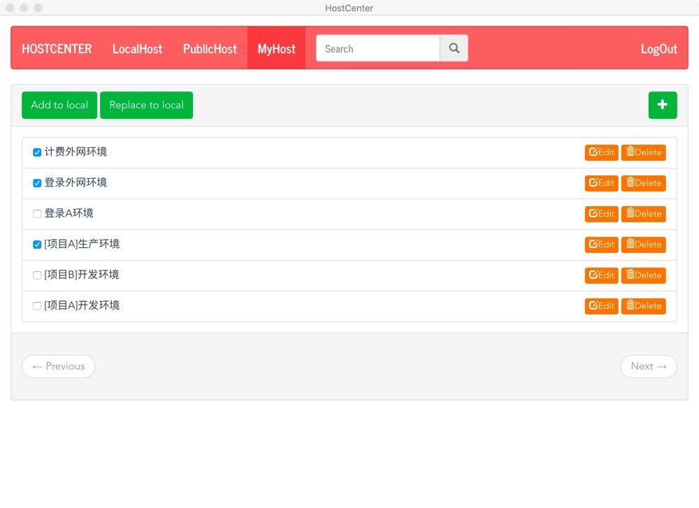

### HostCenter

* Edit your host convenient
* Quick switch hosts like develop environment, product environment, and their free combination
* Furthermore, you can use the hosts we provide to across the gfw to learning and working

### Demo

### Download

* For OSX  [https://github.com/hjlarry/hostcenter/raw/master/download/HostCenter-darwin-x64.zip](https://github.com/hjlarry/hostcenter/raw/master/download/HostCenter-darwin-x64.zip)
* For Linux [https://github.com/hjlarry/hostcenter/blob/master/download/HostCenter-linux-x64.zip](https://github.com/hjlarry/hostcenter/blob/master/download/HostCenter-linux-x64.zip)
* For Windows [https://github.com/hjlarry/hostcenter/blob/master/download/HostCenter-win32-x64.zip](https://github.com/hjlarry/hostcenter/blob/master/download/HostCenter-win32-x64.zip)

### Build and Run

Clone first :

    git clone https://github.com/hjlarry/hostcenter.git

To run the laravel server :

    cd hostcenter
    composer install
    cp .env.example .env //edit config
    php artisan migrate
    
To build the clients :

    cd electron
    npm install
    cd src/renderer/axios.js  //edit server url
    npm run dev  //or npm run build

